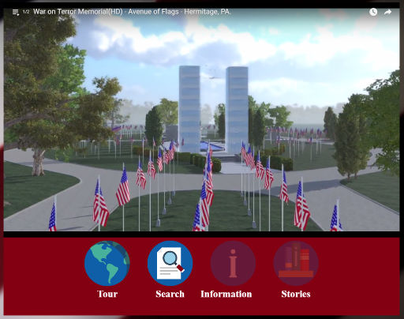
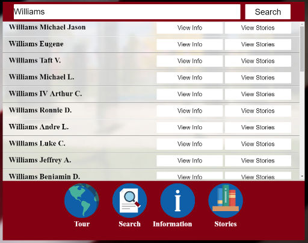
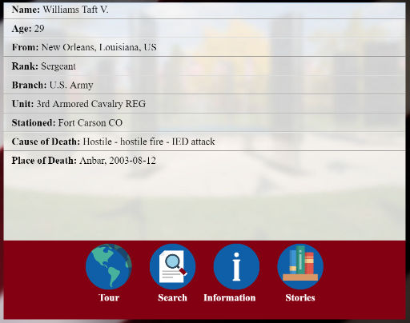
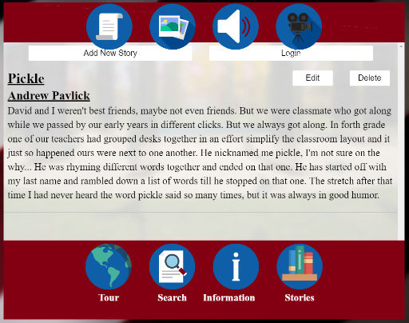

# Virtual Memorial

## Table of Contents
- [Introduction](#introduction)
- [Usage](#usage)
- [Technology](#technology)
- [API](#api)
- [Known Issues](#known issues)
- [Changelog - Since 1.0 Release](#changlog)

### Introduction
The Virtual Memorial is an online memorial meant to compliment the
physical location located in at The Avenue of Flags in Hermitage,
Pennsylvania. It acts as a way for the community to share the memorial
with the community but also for family and friends to share stories
about the men and women who have served.

### Usage
User start off on the tour page and from there can navigate to the search page, or
continue viewing the tour. On the "Search" page users can enter in the first,last,
or a combination of the two to produce results of the existing names on the memorial.

From here the viewer has two option. The first is to view a names information, pictured
below. Information here, provides, name, rank, unit, and more. Whenever the viewer
Navigates away from search, info, or stories, the existing content is stored should they
return during the session.

Users can also select view stories from the search window. Currently this allows viewers
to view text stories(shown below) related to the name which they selected the menu option from. 
Future plans hope to expand on this functionality.

### Technology
#### Front-End
The front-end is built using current web standards for HTML, CSS3, And Javascript
ES5. Future version will take advantage of WebGL 1/2.0. Allowing for dynamic 
viewing of the memorial and searching for name on the 3d representation of the
memorial.

User can also create stories to share with the community. This is currently limited
to text but future plans aim to bring picture, audio, and video support.

#### Back-End
The back-end is built using Node and Express.js, with the application deployed
using the Heroku service.

#### WebGL
The WebGL portion of this application will occur after the initial release of
version 1.0. The goal is to use either 1/2.0 to permit users to view names
on the memorial in 3d which also matches the location on site. Along with name
searching a virtual tour animation will be created and allow for limited user
navigation of the tour.

#### API
Documentation Coming Soon

### Known Issues
- Search: Lowercase cause results issues.
- Search: Special characters cause results issue.

### Changelog
- WIP 1.0 Release Candidate